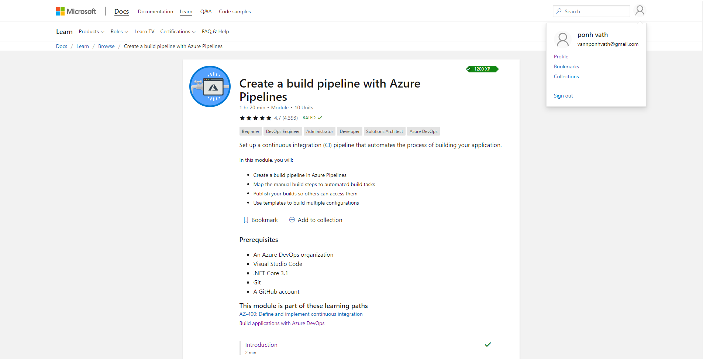
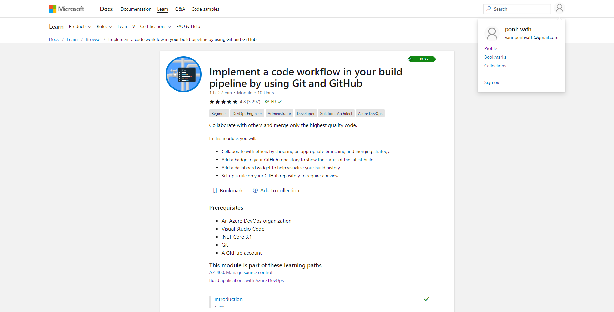
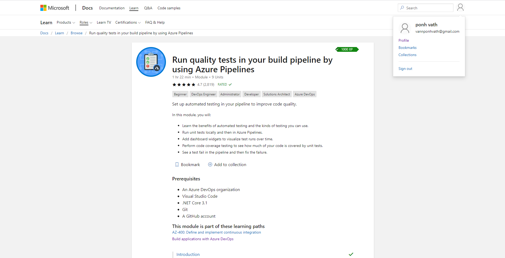

Front-End: https://foodjunkie.azurewebsites.net/
Bacn-End: https://aspdotnet-ponhvath.azurewebsites.net/index.html

# MSA-2020 - Front-End & Azure DevOps Project

- Front-End Repo - [React App](https://github.com/vBoBv/MSA-Phase1-FullStackProject/tree/master/react-app-phase1)
- ASP.NET Repo - [Back-End App](https://github.com/vBoBv/MSA-Phase1-BackendProject)
- Azure DevOps Repo - [Azure Repo](https://github.com/vBoBv/MSA-Phase1-FullStackProject)

## Azure-Pipeline

I defined the pipeline using YAML file as instructed in the tutorial documentation. Whenever, a push is being committed to master branch or develop branch, the pipline will be triggered and ran. Furthermore, I specified a path to exclude the README.md so that the pipeline will not kick off if there are any changes to this file.

```tsx
trigger: branches: include: -master - develop;
paths: exclude: -README.md;
```

After that, I created a variable called `rootDir` which contains a string for my react-app directory name `react-app-phase1`. The `buildDir` variable is created in order to act as a directory to store my react-app application. After setting up the file name and directory, Node will be installed with a version 10.x

```tsx
variables:
  rootDir: 'react-app-phase1'
  buildDir: '$(rootDir)/build'

pool:
  vmImage: 'ubuntu-latest'

steps:
- task: NodeTool@0
  inputs:
    versionSpec: '10.x'
  displayName: 'Install Node.js'
```

After Node installation process is completed, I created a script to extract my Zomato API Key from Azure Key Vault. This is done by specifying my `azureSubscription` and `KeyVaultName` in this case it is the resource name that I set inside Azure Key Vault. I utilized [Azure Key Vault task](https://docs.microsoft.com/en-us/azure/devops/pipelines/tasks/deploy/azure-key-vault?view=azure-devops) and [Use secrets from Azure Key Vault in Azure Pipelines](https://docs.microsoft.com/en-us/azure/devops/pipelines/release/azure-key-vault?view=azure-devops) as references for this step. This task will download my api key as a variable called `zomatoApiKey`. Later on, React app is being built along with the creation of `.env.production` file which contains the api key as shown below:

```tsx
- task: AzureKeyVault@1
  inputs:
    azureSubscription: 'Azure für Bildungseinrichtungen(1169a369-f083-425e-8a9b-45b15bbfa7ae)'
    KeyVaultName: 'zomato-api-key'
    SecretsFilter: '*'
    RunAsPreJob: false

- script: |
    cd $(rootDir)
    echo "REACT_APP_ZOMATO_KEY=$(zomatoApiKey)" > .env.production
    npm install
    npm run build
    cd ..
  displayName: 'npm install and build'
```

Finally, I created a task to archive the build folder. This archive file can be then used as an artifact to create releases.

```tsx
- task: ArchiveFiles@2
  inputs:
    rootFolderOrFile: '$(buildDir)'
    includeRootFolder: false
    archiveType: 'zip'
    archiveFile: '$(Build.ArtifactStagingDirectory)/$(Build.BuildId).zip'
    replaceExistingArchive: true

- task: PublishBuildArtifacts@1
  inputs:
    PathtoPublish: '$(Build.ArtifactStagingDirectory)'
    ArtifactName: 'drop'
    publishLocation: 'Container'
```

Full azure-pipeline.yml file:

```tsx
trigger:
  branches:
    include:
      - master
      - develop
  paths:
    exclude:
      - README.md

variables:
  rootDir: 'react-app-phase1'
  buildDir: '$(rootDir)/build'

pool:
  vmImage: 'ubuntu-latest'

steps:
- task: NodeTool@0
  inputs:
    versionSpec: '10.x'
  displayName: 'Install Node.js'

- task: AzureKeyVault@1
  inputs:
    azureSubscription: 'Azure für Bildungseinrichtungen(1169a369-f083-425e-8a9b-45b15bbfa7ae)'
    KeyVaultName: 'zomato-api-key'
    SecretsFilter: '*'
    RunAsPreJob: false

- script: |
    cd $(rootDir)
    echo "REACT_APP_ZOMATO_KEY=$(zomatoApiKey)" > .env.production
    npm install
    npm run build
    cd ..
  displayName: 'npm install and build'

- task: ArchiveFiles@2
  inputs:
    rootFolderOrFile: '$(buildDir)'
    includeRootFolder: false
    archiveType: 'zip'
    archiveFile: '$(Build.ArtifactStagingDirectory)/$(Build.BuildId).zip'
    replaceExistingArchive: true

- task: PublishBuildArtifacts@1
  inputs:
    PathtoPublish: '$(Build.ArtifactStagingDirectory)'
    ArtifactName: 'drop'
    publishLocation: 'Container'
```

## Continuous Integration and Continuous Deployment


The lastest artifact that is published by the pipeline will be used to delpoy our web app to the Azure App Service. This can be done by enabling the continuous deployment feature. Note that, this CD feature is only enabled for the master branch. Any other commits that are being pushed to GitHub will only trigger the pipeline to create an artifact, however it will not deploy the app to the Azure App Service except commits that are being pushed to the master branch.

## Microsoft Learn Module




