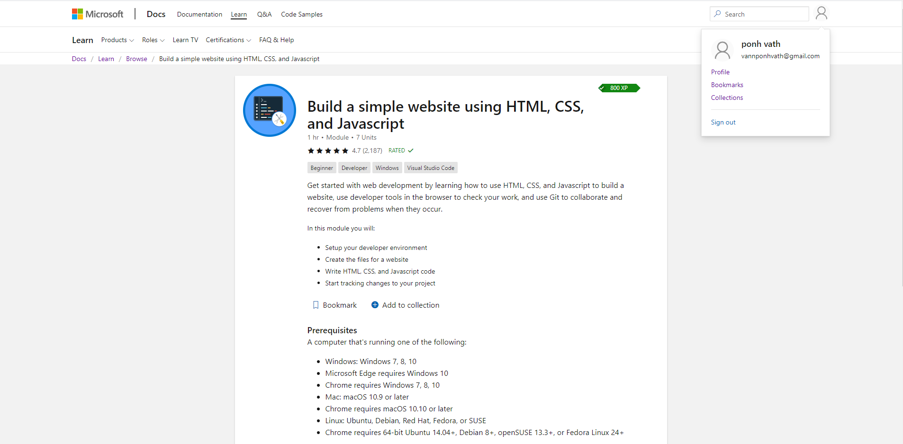

# MSA-2020 Front-End Project

Project Website: https://foodjunkie.azurewebsites.net/

### Project Dependencies

- [React](https://github.com/facebook/create-react-app)
- [Typescript](https://www.typescriptlang.org/)
- [Axios](https://www.npmjs.com/package/axios)
- [React Multi-Carousel](https://www.npmjs.com/package/react-multi-carousel)
- [Material-UI](https://material-ui.com/)
- [Zomato](https://developers.zomato.com/api)
- [Lodash](https://www.npmjs.com/package/lodash)

### Microsoft Learn Module



### Running the project locally

1. Download or clone the project
2. Generate your own Zomato's API Key via
3. Create `.env.development` and `.env.production` (optional) inside the root folder `react-app-phase1`
4. Inside .env.development and .env.production:

```tsx
REACT_APP_ZOMATO_KEY={Zomato API key}
```

5. Run: `npm install`
6. Run: `npm run start`
